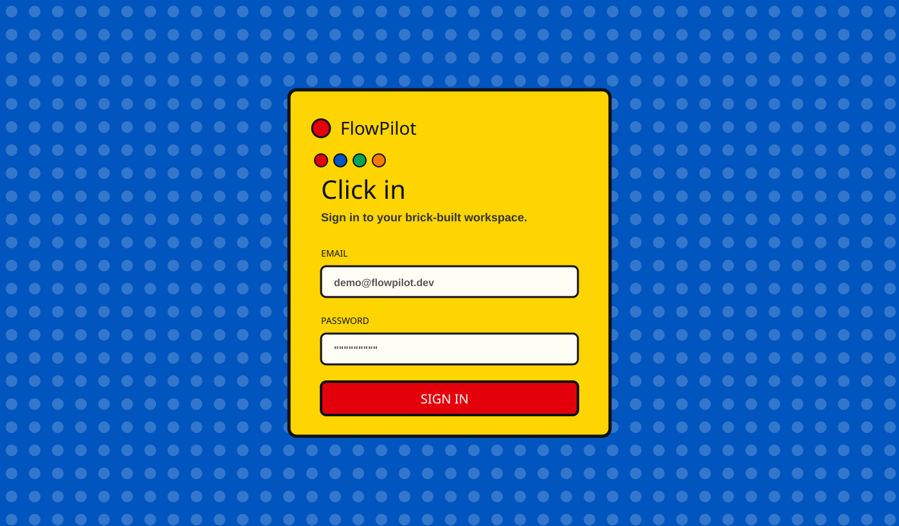
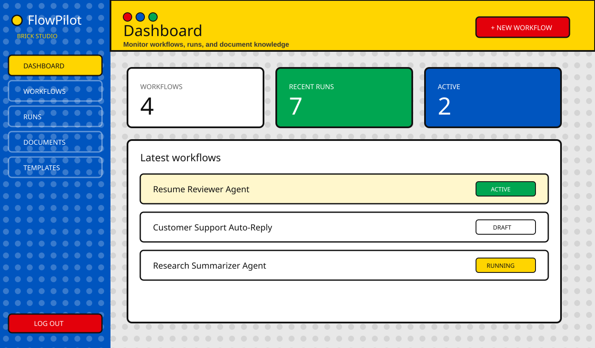
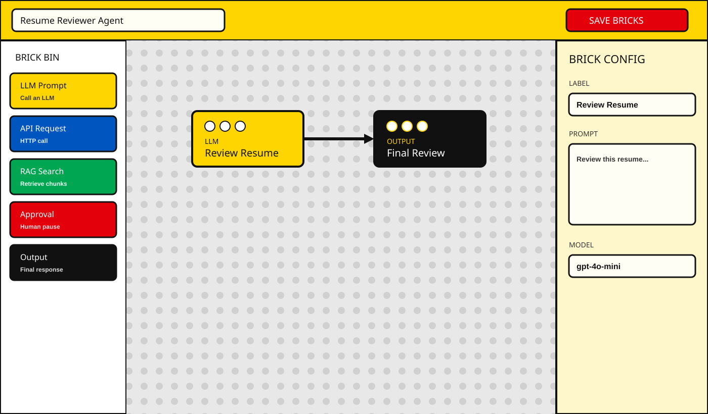
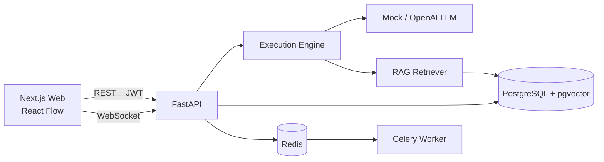

# FlowPilot

**Snap AI agent workflows together like bricks.**

FlowPilot is a full-stack visual workflow builder for designing, running, and observing LLM-powered automations. Drag nodes onto a canvas, connect them, execute the graph, and watch live traces stream in over WebSockets.


**Live stack:** Next.js · FastAPI · PostgreSQL + pgvector · Redis · Docker · GitHub Actions

Demo login after setup: `demo@flowpilot.dev` / `demo12345`

---

## Screenshots

Lego brick UI — studded baseplates, thick borders, and color-coded workflow bricks.

### Landing


### Login


### Dashboard


### Visual workflow builder


### Live run observability


---

## Why this project

Built as a recruiter-friendly portfolio app that demonstrates:

- Product-minded frontend UI (Lego brick design system)
- Graph-based workflow modeling with React Flow
- Async execution engine with retries, timeouts, and branching
- Realtime observability over WebSockets
- RAG pipeline with chunking + embeddings (mock or OpenAI)
- JWT auth with per-user data isolation
- Dockerized local stack + CI

---

## Architecture



```text
FlowPilot/
├── apps/
│   ├── web/                 # Next.js 14 + Tailwind + React Flow (Lego UI)
│   └── api/                 # FastAPI + SQLAlchemy + execution engine
├── packages/shared/         # Shared TypeScript types
├── docker/                  # Docker notes
├── docs/screenshots/        # README visuals
├── .github/workflows/ci.yml # Lint, test, build, Docker image checks
├── docker-compose.yml       # web, api, worker, postgres, redis
└── .env.example
```

---

## Tech stack

| Layer | Tools |
|-------|--------|
| Frontend | Next.js 14, TypeScript, Tailwind CSS, React Flow (`@xyflow/react`), lucide-react |
| Backend | FastAPI, SQLAlchemy (async), Alembic, Pydantic, Celery |
| Data | PostgreSQL 16 + pgvector, Redis |
| Auth | JWT (signup / login / protected routes) |
| Realtime | WebSockets (`/ws/runs/{id}`) |
| DevOps | Docker Compose, GitHub Actions |

---

## Features

### Visual builder
- Drag-and-drop brick nodes on a studded canvas
- Node types: **LLM**, **API**, **Database**, **Condition**, **RAG**, **Human Approval**, **Output**
- Right-side config panel + save-time validation

### Execution engine
- Loads workflow JSON and validates the graph (also on save / run)
- Topological / dependency-aware execution with fan-in joins
- Retries + per-node timeouts
- Stops on failed required nodes
- Human-approval nodes pause the run; resume via `POST /runs/{id}/decision`
- Local runs use FastAPI background tasks (`USE_CELERY=false`)
- Docker Compose sets `USE_CELERY=true` so the Celery worker executes runs; Redis pub/sub fans out live events to WebSockets

### Observability
- Run history with status filters
- Node-level traces (input/output/logs)
- Token usage + estimated cost
- Duration + retry counts
- Live status streaming over WebSockets

### RAG
- Upload TXT / MD / PDF
- Text extraction, chunking, embeddings
- pgvector-ready storage
- Mock embeddings by default (no API key required)

### Templates
1. **Resume Reviewer Agent** — LLM → Output  
2. **Customer Support Auto-Reply Agent** — RAG → LLM → Approval → Output  
3. **Research Summarizer Agent** — API → LLM → Output  

### Auth & multi-user
- Signup / login / logout
- Protected dashboard routes
- Workflows, runs, and documents scoped to the authenticated user

---

## Quick start (Docker)

Requires Docker Desktop.

```bash
git clone https://github.com/khushi491/FlowPilot.git
cd FlowPilot
cp .env.example .env
docker compose up --build
```

| Service | URL |
|---------|-----|
| Web app | http://localhost:3000 |
| API | http://localhost:8000 |
| Swagger | http://localhost:8000/docs |

The API container runs migrations and seeds demo data on startup.

**Demo account**

```text
Email:    demo@flowpilot.dev
Password: demo12345
```

Re-seed manually if needed:

```bash
docker compose exec api python -m app.scripts.seed
```

---

## Local development (without full Docker app stack)

### 1) Infra

```bash
docker compose up -d postgres redis
```

Postgres is exposed on host port **5433** (see `.env.example`).

### 2) API

```bash
cd apps/api
python3 -m venv .venv
source .venv/bin/activate
pip install -r requirements.txt
alembic upgrade head
python -m app.scripts.seed
uvicorn app.main:app --reload --port 8000
```

### 3) Web (repo root)

```bash
npm install
npm run dev --workspace=apps/web
```

Open http://localhost:3000 and sign in with the demo account.

> Use **npm** (workspaces). pnpm/yarn are not configured for this monorepo.

---

## Environment variables

Copy [`.env.example`](.env.example) → `.env`.

| Variable | Purpose |
|----------|---------|
| `DATABASE_URL` | Async SQLAlchemy URL (`postgresql+asyncpg://...`) |
| `DATABASE_URL_SYNC` | Alembic sync URL |
| `REDIS_URL` | Redis / Celery broker + run event pub/sub |
| `USE_CELERY` | `true` = enqueue runs to Celery worker; `false` = in-process (default locally) |
| `JWT_SECRET` | JWT signing secret |
| `APP_ENV` | `development` allows placeholder JWT; non-dev requires a strong secret |
| `CORS_ORIGINS` | Allowed frontend origins |
| `NEXT_PUBLIC_API_URL` | Browser API base (`http://localhost:8000`) |
| `NEXT_PUBLIC_WS_URL` | Browser WebSocket base (`ws://localhost:8000`) |
| `USE_MOCK_LLM` | `true` = mock LLM (default) |
| `USE_MOCK_EMBEDDINGS` | `true` = deterministic local embeddings (default) |
| `OPENAI_API_KEY` | Optional real LLM / embedding calls |

For local API against Docker Postgres, keep host port **5433** in `.env`.  
Inside Compose, services talk to `postgres:5432`.

---

## API overview

Interactive docs: http://localhost:8000/docs

| Area | Endpoints |
|------|-----------|
| Auth | `POST /auth/signup`, `POST /auth/login`, `GET /auth/me`, `POST /auth/logout` |
| Workflows | `POST/GET/PUT/DELETE /workflows` |
| Runs | `POST /workflows/{id}/runs`, `GET /runs`, `GET /runs/{id}`, `GET /runs/{id}/nodes`, `POST /runs/{id}/decision` |
| Documents | `POST /documents/upload`, `GET /documents`, `DELETE /documents/{id}` |
| Templates | `GET /templates`, `POST /templates/{id}/use` |
| Realtime | `WS /ws/runs/{id}` |
| Health | `GET /health` |

---

## Try a demo flow

1. Sign in with the demo account  
2. Open **Templates** → **Use template** (e.g. Resume Reviewer)  
3. Open the workflow → tweak bricks → **Save**  
4. Click **Run**  
5. Watch the live timeline + node traces on the run page  
6. Upload a doc under **Documents** and try the Support Auto-Reply template  

---

## Scripts

```bash
# Frontend
npm run lint
npm run test:web
npm run build

# Backend
npm run test:api
# or: cd apps/api && python -m pytest -q

# Full stack
docker compose up --build
```

CI (`.github/workflows/ci.yml`) runs lint, tests, frontend build, and Docker image builds on every push/PR to `main`.

---

## Design notes

The UI uses a **Lego brick theme**:

- Classic brick colors (red / yellow / blue / green)
- Studded baseplate backgrounds
- Thick bordered “brick” panels and buttons
- Color-coded workflow nodes

---

## Future improvements

- Resume paused runs from a human-approval inbox
- Highlight active condition branches during execution
- OpenTelemetry / structured tracing export
- Team workspaces + roles
- Function-calling / tool nodes
- One-click cloud deploy (Fly.io / Render / AWS)

---

## License

MIT
