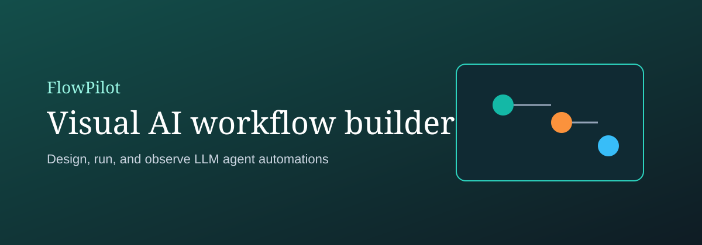
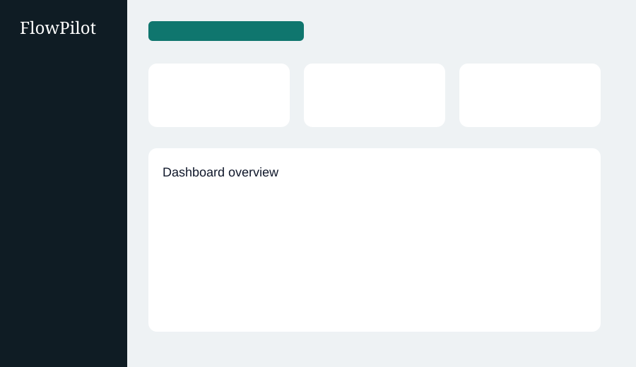
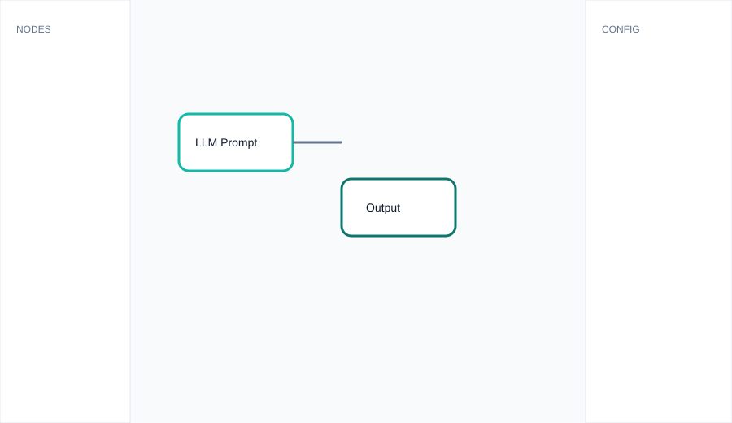
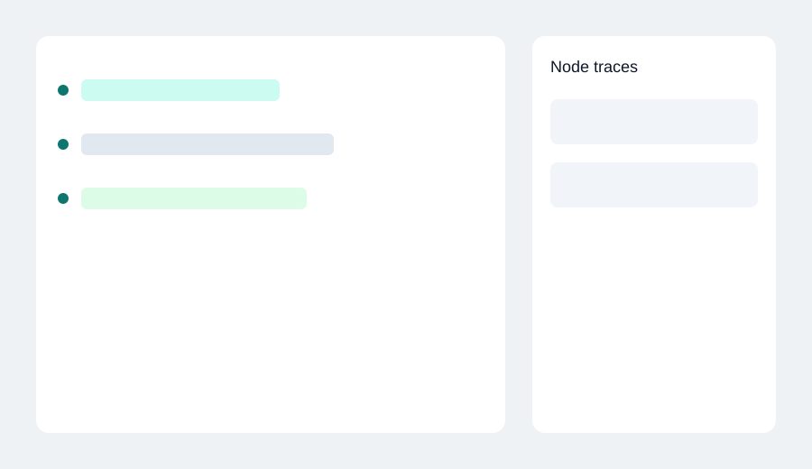
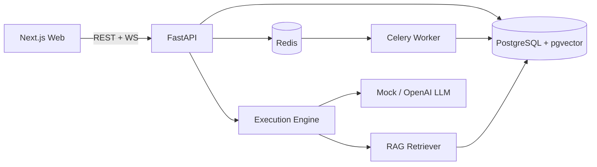

# FlowPilot

**Visual AI-agent workflow builder** for creating, running, and monitoring LLM-powered automation with drag-and-drop nodes, realtime traces, and RAG document retrieval.



## Screenshots

| Dashboard | Workflow builder | Live run traces |
|-----------|------------------|-----------------|
|  |  |  |

> Tip: replace the SVG placeholders in `docs/screenshots/` with real product captures for your portfolio.

## Architecture



```
FlowPilot/
├── apps/
│   ├── web/                 # Next.js + React Flow UI
│   └── api/                 # FastAPI + execution engine
├── packages/shared/         # Shared TypeScript types
├── docker/                  # Docker docs/assets
├── docs/screenshots/        # README visuals
├── .github/workflows/       # CI pipeline
└── docker-compose.yml
```

## Tech Stack

- **Frontend:** Next.js, TypeScript, Tailwind CSS, React Flow, lucide-react
- **Backend:** FastAPI, SQLAlchemy, Alembic, Pydantic
- **Database:** PostgreSQL + pgvector
- **Queue:** Redis + Celery
- **Realtime:** WebSockets
- **Auth:** JWT (signup / login / protected routes)
- **Deploy:** Docker Compose + GitHub Actions

## Features

- Drag-and-drop visual workflow builder
- Node types: LLM, API, Database, Condition, RAG, Human Approval, Output
- Workflow validation before save
- Dependency-ordered execution with retries + timeouts
- Realtime run/node status streaming
- Node-level traces, tokens, cost estimates, duration
- Document upload (TXT/MD/PDF), chunking, embeddings, RAG retrieval
- Built-in templates (Resume Reviewer, Support Auto-Reply, Research Summarizer)
- Multi-user JWT auth with per-user data isolation
- Dockerized local development and CI checks

## Local Setup

### Option A — Docker (recommended)

```bash
git clone https://github.com/khushi491/FlowPilot.git
cd FlowPilot
cp .env.example .env
docker compose up --build
```

- Web: http://localhost:3000
- API: http://localhost:8000
- Swagger: http://localhost:8000/docs

Seed a demo account (after API is up):

```bash
docker compose exec api python -m app.scripts.seed
```

Demo login: `demo@flowpilot.dev` / `demo12345`

### Option B — Manual

```bash
# Infra
docker compose up -d postgres redis

# API
cd apps/api
python -m venv .venv
source .venv/bin/activate
pip install -r requirements.txt
alembic upgrade head
uvicorn app.main:app --reload --port 8000

# Web (new terminal, repo root)
npm install
npm run dev --workspace=apps/web
```

## Environment Variables

See [`.env.example`](.env.example).

| Variable | Purpose |
|----------|---------|
| `DATABASE_URL` | Async SQLAlchemy URL |
| `DATABASE_URL_SYNC` | Alembic sync URL |
| `REDIS_URL` | Celery broker |
| `JWT_SECRET` | Auth signing secret |
| `NEXT_PUBLIC_API_URL` | Browser API base URL |
| `NEXT_PUBLIC_WS_URL` | Browser WebSocket base URL |
| `USE_MOCK_LLM` | Use mock LLM responses |
| `USE_MOCK_EMBEDDINGS` | Use deterministic local embeddings |
| `OPENAI_API_KEY` | Optional real LLM/embeddings |

## API Documentation

Interactive docs: `http://localhost:8000/docs`

Core endpoints:

- `POST /auth/signup`, `POST /auth/login`, `GET /auth/me`
- `POST/GET/PUT/DELETE /workflows`
- `POST /workflows/{id}/runs`
- `GET /runs`, `GET /runs/{id}`, `GET /runs/{id}/nodes`
- `POST /documents/upload`, `GET /documents`, `DELETE /documents/{id}`
- `GET /templates`, `POST /templates/{id}/use`
- `WS /ws/runs/{id}`

## Demo Workflow Examples

1. **Resume Reviewer Agent** — LLM review + structured output
2. **Customer Support Auto-Reply** — RAG → LLM → human approval → output
3. **Research Summarizer** — API fetch → LLM summary → output

Create from **Templates**, open the builder, click **Run**, and watch live traces on the run page.

## Scripts

```bash
npm run lint
npm run test
npm run build
cd apps/api && python -m pytest -q
docker compose up --build
```

## Future Improvements

- Visual condition branch highlighting during runs
- Persistent approval inbox UI + resume-from-pause
- OpenTelemetry tracing export
- Team workspaces and role-based access
- Native tool/function-calling nodes
- Managed cloud deploy (Fly.io / Render / AWS)

## License

MIT
